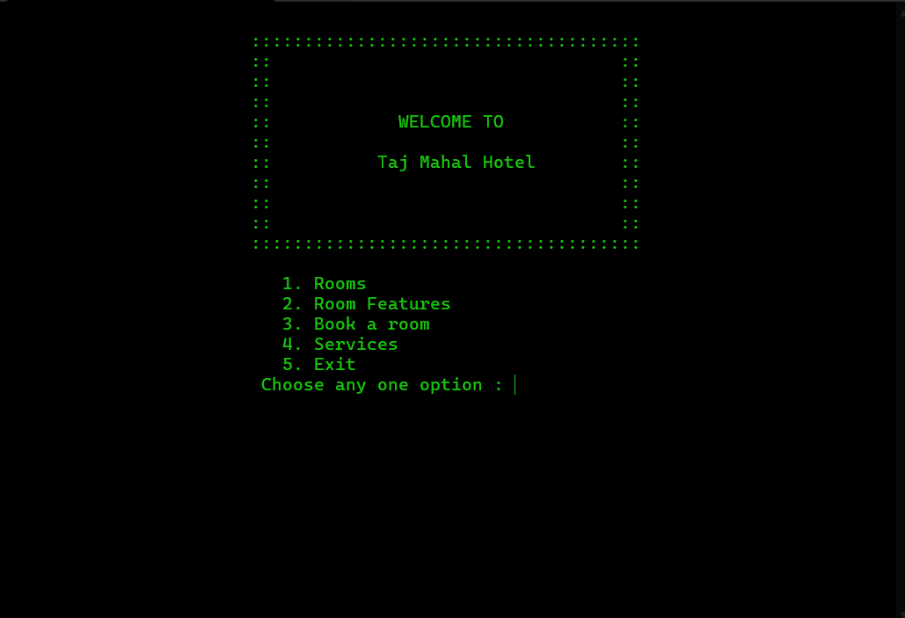

# Hotel-Reservation-System-in-C
This is a simple C program simulating a hotel reservation system. Features include viewing room availability, checking room details, booking rooms, and viewing services. It uses user inputs, calculates costs, and offers card and cash payment options.

**Homepage:**

